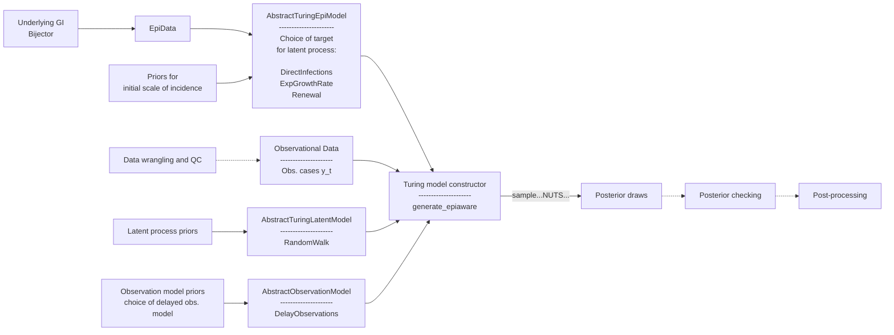

# EpiAware.jl

A `Julia` package for flexible and composable modeling and inference of the effective reproduction number (Rt) and other situational awareness signals in the presence of different latent generative processes and observation models.

## Model Diagram

- Solid lines indicate implemented features/analysis.
- Dashed lines indicate planned features/analysis.

## Current `EpiAware` model diagram

## Pluto scripts

We use [`Pluto.jl`](https://plutojl.org/) scripts as part of our documentation and testing. The scripts are located in `docs/src/examples` and can be run using the `Pluto.jl` package. We recommend using the version of `Pluto` that is pinned in the `Project.toml` file defining the documentation environment. An entry point to running or developing this documentation is the `docs/pluto-scripts.sh` bash shell script. Run this from the root directory of this repository.
