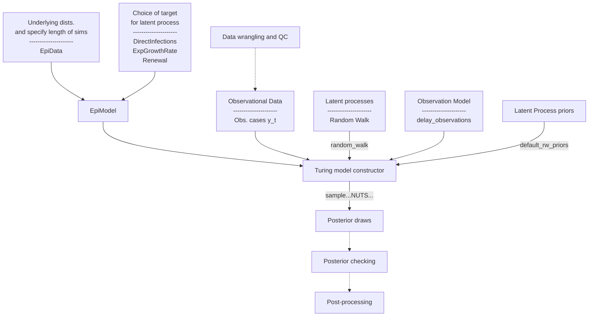

# EpiAware

## Model Diagram

- Solid lines indicate implemented features/analysis.
- Dashed lines indicate planned features/analysis.

```mermaid
flowchart TD

    A["Underlying dists.
and specify length of sims
---------------------
EpiData"]

    B["Choice of target
for latent process
---------------------
DirectInfections
    ExpGrowthRate
    Renewal"]

C["Observational Data
---------------------
Obs. cases y_t"]
D["Latent processes
---------------------
Random Walk"]
E[Turing model constructor]
F["Latent Process priors"]
G[Posterior draws]
H[Posterior checking]
I[Post-processing]
DataW[Data wrangling and QC]
J["Observation Model
---------------------
delay_observations"]

A --> EpiModel
B --> EpiModel
EpiModel -->E
C-->E
D-->|random_walk| E
J-->E
F-->|default_rw_priors|E
E-->|sample...NUTS...| G
G-.->H
H-.->I
DataW-.->C
```
