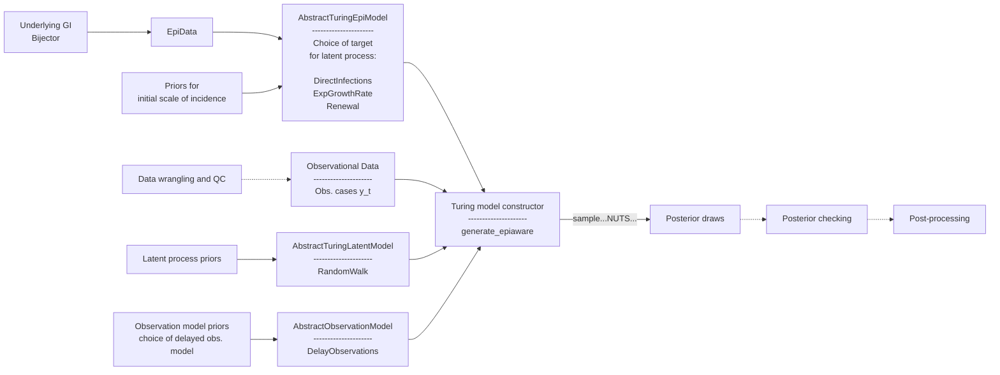

# Getting Started: EpiProblem Interface

Each module of the overall epidemiological model we are interested in is a `Turing` `Model` in its own right. In this section, we compose the individual models into the full epidemiological model using the `EpiProblem` struct.

The constructor for an `EpiProblem` requires:

- An `epi_model`.
- A `latent_model`.
- An `observation_model`.
- A `tspan`.

The `tspan` set the range of the time index for the models.

The diagram below shows the relationship between the modules in the package for a typical workflow.

