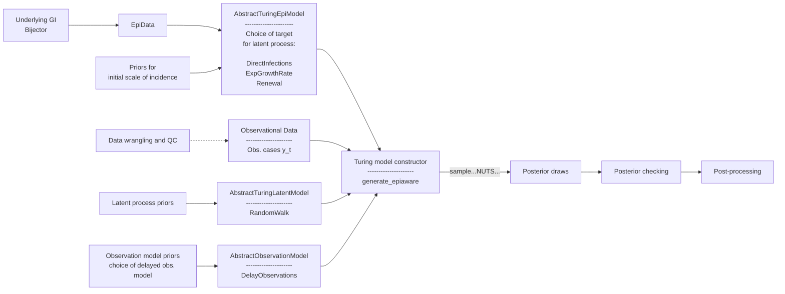

The diagram below shows the relationship between the modules in the package for a typical workflow.

```mermaid
flowchart LR

A["Underlying GI
Bijector"]

EpiModel["AbstractTuringEpiModel
----------------------
Choice of target
for latent process:

DirectInfections
    ExpGrowthRate
    Renewal"]

InitModel["Priors for
initial scale of incidence"]

DataW[Data wrangling and QC]


ObsData["Observational Data
---------------------
Obs. cases y_t"]

LatentProcPriors["Latent process priors"]

LatentProc["AbstractTuringLatentModel
---------------------
RandomWalk"]

ObsModelPriors["Observation model priors
choice of delayed obs. model"]

ObsModel["AbstractObservationModel
---------------------
DelayObservations"]

E["Turing model constructor
---------------------
generate_epiaware"]

G[Posterior draws]
H[Posterior checking]
I[Post-processing]


A --> EpiData
EpiData --> EpiModel
InitModel --> EpiModel
EpiModel -->E
ObsData-->E
DataW-.->ObsData
LatentProcPriors-->LatentProc
LatentProc-->E
ObsModelPriors-->ObsModel
ObsModel-->E


E-->|sample...NUTS...| G
G-->H
H-->I
```
